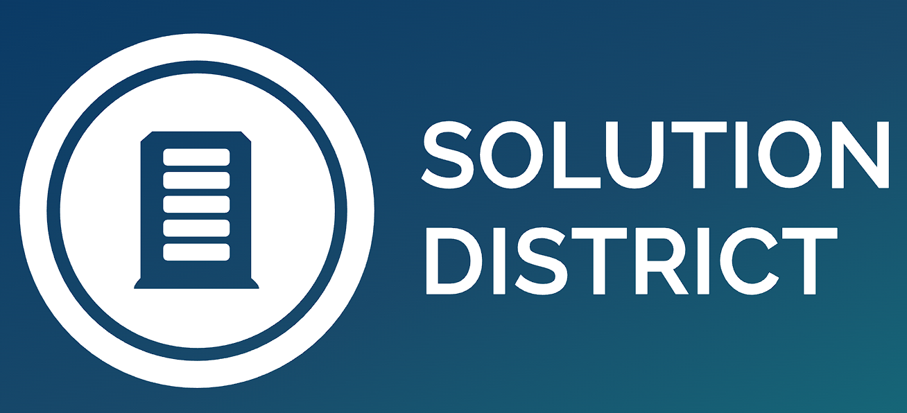

# Solution District

<p float="left">
	
</p>

# What is Solution District?

Solution District is a web application that aims to aid researchers in coming up with interesting and new topics for future research. This project helps researchers from all fields of study to find and consider relevant topics to be researched before choosing. Users shall simply present their topic to the website before proceeding to submit their requests. The importance of a topic or a combination of topics is determined by the score calculated by certain algorithms according to the user's preference.

## Installing

You can click [here](https://gitlab.com/wenjye00/segp/-/archive/master/segp-master.zip) to download this project in a .zip file.
You can also download it in other formats by clicking the download button inside the main repository [here](https://gitlab.com/wenjye00/segp).

## Prerequisites

The programming language used for our project is mainly Python, so please make sure that you have the latest version of python installed.
You can download the latest version of Python here: https://www.python.org/downloads/

There are several prequisite python modules that are needed to run the project.
To download them, please make sure that you have the latest version of [pip](https://pypi.org/project/pip/) installed on your device.
If you do not have pip installed, you can donwload it here: https://bootstrap.pypa.io/get-pip.py

The [Django](https://www.djangoproject.com/) Web Framework is imperative for this project.
You can donwload it [here](https://docs.djangoproject.com/en/3.2/intro/install/) or if you have pip installed you can use the following
```
pip install django
```

To download the rest of the prerequisite packages that are needed to run our project, kindly click and run the <strong>Prerequisites.cmd</strong> file after installing and extracting the project folder.

## Getting Started

After installing and extracting the project folder, 
navigate into the segp/project_1 folder where the manage.py file is located using command prompt.

### Running the web applicaton in localhost server
Enter the following line into the command prompt to start the local server:
```
python manage.py runserver
```
<strong>Do not</strong> exit the command prompt after running the above command.
After the local server is running in the command prompt, enter http://127.0.0.1:8000/ into an internet browser to start accessing the web application.

### Halting of the localhost server
To terminate the localhost server, open the command prompt that localhost server is running in.
Use CTRL + BREAK/PAUSE to terminate the localhost server.
